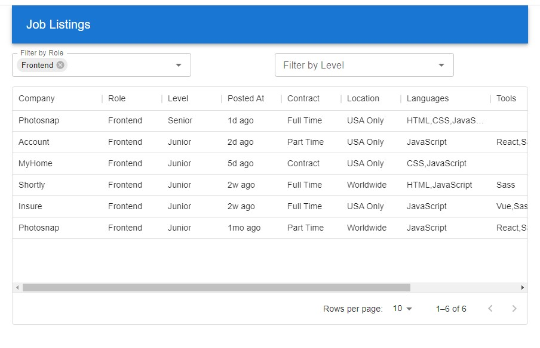

## Description:

A ReactJS + Laravel + MariaDB job listings application with some dummy data.

## Installation:

You will need to have PHP version ^8.0.2 installed

1. Install dependencies (from the server/ directory):

```sh
    composer update
```

2. Build and run the containers:

```sh
    docker-compose up --build -d
```

3. Give the containers about 30 seconds after starting up and then run the setup script. This will run the migrations and seed the database.

```sh
    cd ..
    sh setup.sh
```

4. Navigate to http://localhost:3000/ in your browser.
5. To remove the containers:

```sh
    docker-compose down
```

## PHP My Admin:

PHP My Admin has also been included should you wish to use it.
Navigate to http://localhost:8081/ and log in with the credentials defined in the docker-compose file:

Host: mariadb

Username: admin

Password: ""
